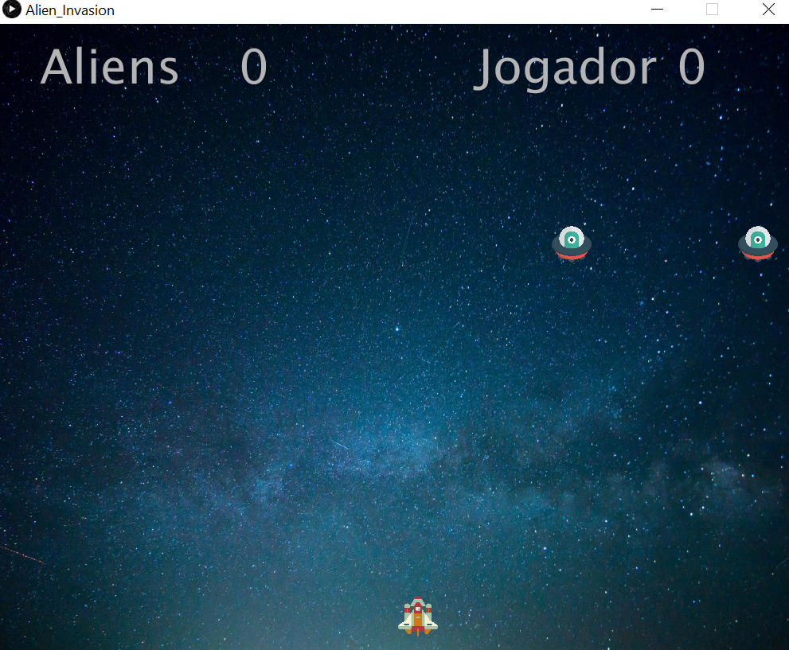
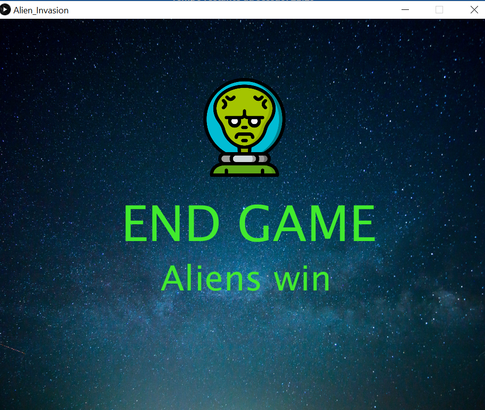
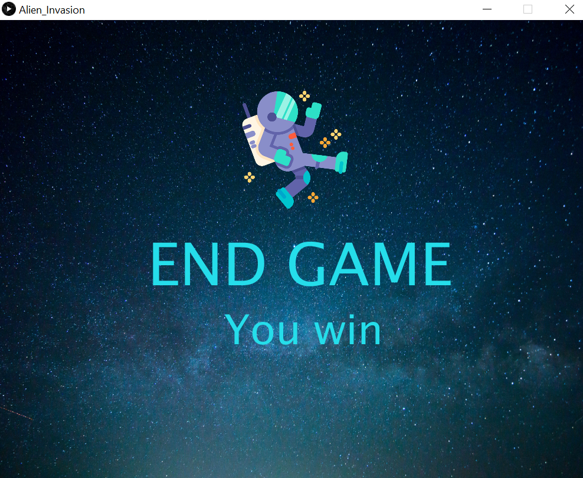

	

<h1 align="center">Alien Invasion</h1>

## Status

<h4 align="center"> 
	Alien Invasion - Finished! ✅
</h4>

## Description

Alien Invasion is a game created in Processing inspired by Atari's Space Invaders. The player takes on the role of a pilot of a spaceship that seeks to protect the earth from an alien attack. It was a project created in the course of Digital Systems and Media with the objective of combining media knowledge with the programming base.

## Content

- [Description](#description)
- [Status](#status)
- [Content](#content)
- [How to use it?](#how-to-use-it)
- [Stack and Technoloy](#stack-and-technology)
- [ApplicationPhotos](#application-photos)

## How to use it?

Alien Invasion is a Processing's application

1. Clone the repository
2. Download the processing
3. Keep the folder structure

## Stack and Technology

- Processing

## Application Photos

